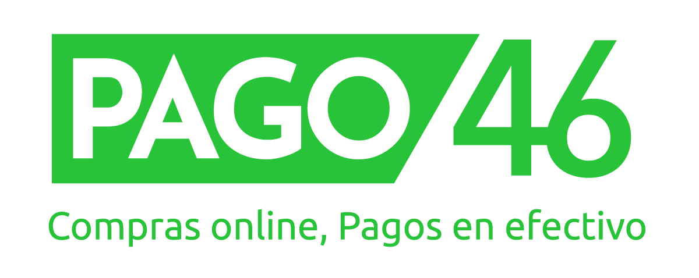

  

<h3 align="center">Pago46: Financial Services for Latin America</h3>

    Engineering economic access and opportunity across LATAM
     
     
    <a href="https://pago46.com/"><strong>Explore our platform »</strong></a>
     
     
  

## Our Mission

We are building the **financial infrastructure for the unbanked and underbanked
population of Latin America**. We create accessible, reliable, and scalable
financial tools that enable economic participation for millions across the
region.

## For Developers & Partners

Integrate with our platform and access comprehensive technical documentation:

**📚 [docs.pago46.io](https://docs.pago46.io)** - Complete integration guides,
API documentation, and best practices for:

- **Merchant Integrations** - Connect your business to our payment
  infrastructure
- **External Networks** - Partner with us to expand financial access
- **Custom Products** - Build tailored financial solutions

## Careers

Join our engineering team building the future of financial infrastructure in
Latin America.

**Contact:** [rrhh@46degrees.net](mailto:rrhh@46degrees.net)

## Connect

- **Platform:** [pago46.com](https://pago46.com/)
- **Documentation:** [docs.pago46.io](https://docs.pago46.io)
- **Contact:** [info@pago46.com](mailto:info@pago46.com)

Building accessible financial infrastructure for Latin America
